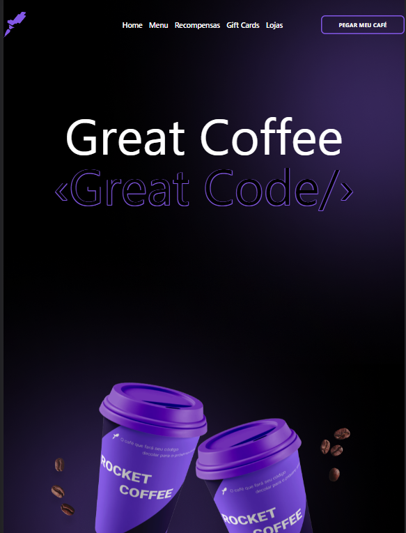

# ROCKETSEAT - RocketCoffee

This is a solution to the [RocketCoffee on RocketSeat]([Notion – The all-in-one workspace for your notes, tasks, wikis, and databases.](https://efficient-sloth-d85.notion.site/Desafio-RocketCoffee-7802895f0dd44da5a6f71a64badc7e72)).

## Table of contents

- [Overview](#overview)
  - [Screenshot](#screenshot)
- [My process](#my-process)
  - [Built with](#built-with)

## Overview

Project Overview for Practicing HTML, CSS and React with SCSS and Tailwind:

Project Name: "RocketCoffee" 

Description: The "RocketCoffee" project is a Rocketseat learning proposal to develop web development skills to work with responsiveness. The goal is to create a homepage for a coffee brand. 

Project Features: 

Responsive Layout: The site will be designed to adapt to different screen sizes, ensuring a consistent experience on mobile devices, tablets and desktops. 

Navigation: There will be a navigation menu at the top or side of the site to allow users to easily move between pages.

Content: The website will display information about the coffee brand. 

Styling with SCSS and Tailwind: The project will use the SCSS preprocessor to write styles in a more efficient and modular way. Tailwind CSS will also be used to speed up styling by taking advantage of utility classes. 

Componentization with React: The site will be developed using the React library to create reusable components and keep the code organized. 

Version Control: Project code will be managed using Git and hosted on GitHub for version control and collaboration.

### Screenshot

Full HD (1920px x 1080px)

HD (1280px x 720px)

Tablet (768px x 1024px)

Iphone XR (414px x 896px)

Iphone XR - Menu open (414px x 896px)

### 

## My process

### Built with

- HTML5
- ReactJS
- CSS and SCSS
- Flexbox
- Tailwind
- [React](https://reactjs.org/) - JS library
